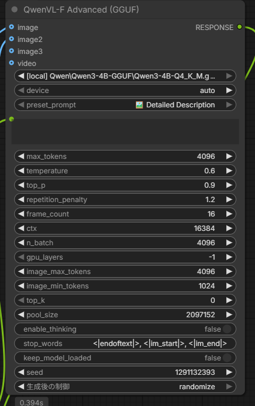

# **QwenVL for ComfyUI (Fork)**

This is a fork of [1038lab/ComfyUI-QwenVL](https://github.com/1038lab/ComfyUI-QwenVL) with the following additions:

## **Fork Changes**

- **Local model file loading**: Load `.gguf` files directly from your local disk without catalog registration. Files found under `base_dir` are listed as `[local] relative/path` in the model dropdown.
- **Multiple image reference support**: Advanced nodes (HF / GGUF) accept up to 3 image inputs (`image`, `image2`, `image3`) for simultaneous multi-image analysis.
- **Thinking mode toggle**: `enable_thinking` switch on all nodes (Simple / Advanced, HF / GGUF). Enables the `<think>...</think>` reasoning mode for Qwen3-VL Thinking models; disabled by default.



---

*Below is the original README from the upstream repository.*

---

# **QwenVL for ComfyUI**

The ComfyUI-QwenVL custom node integrates the powerful Qwen-VL series of vision-language models (LVLMs) from Alibaba Cloud, including the latest Qwen3-VL and Qwen2.5-VL, plus GGUF backends and text-only Qwen3 support. This advanced node enables seamless multimodal AI capabilities within your ComfyUI workflows, allowing for efficient text generation, image understanding, and video analysis.


## **📰 News & Updates**
* **2026/02/08**: **v2.1.1**  Fixed compatibility for  Transformers 4.x and 5.x [[Update](https://github.com/1038lab/ComfyUI-QwenVL/blob/main/update.md#version-211-20260208)]

* **2026/02/05**: **v2.1.0** Added SageAttention support with per-GPU architecture optimization, improved FP8 model handling, and automatic attention mode selection. [[Update](https://github.com/1038lab/ComfyUI-QwenVL/blob/main/update.md#version-210-20260205)]
  * **SageAttention Support**: New attention mode with per-GPU optimized kernels (SM80, SM89, SM90, SM120)
  * **Improved FP8 Handling**: Better support for pre-quantized FP8 models with automatic SDPA fallback
  * **Smart Attention Selection**: Auto mode now tries Sage → Flash → SDPA for optimal performance
  * **Progress Bar**: Added ComfyUI progress bar for model loading and generation stages
  * **Better Memory Management**: Improved cache clearing when changing attention modes or quantization
* **2025/12/22**: **v2.0.0** Added GGUF supported nodes and Prompt Enhancer nodes. [[Update](https://github.com/1038lab/ComfyUI-QwenVL/blob/main/update.md#version-200-20251222)]
> [!IMPORTANT]  
> Install llama-cpp-python before running GGUF nodes [instruction](docs/LLAMA_CPP_PYTHON_VISION_INSTALL.md)
> 

* **2025/11/10**: **v1.1.0** Runtime overhaul with attention-mode selector, flash-attn auto detection, smarter caching, and quantization/torch.compile controls in both nodes. [[Update](https://github.com/1038lab/ComfyUI-QwenVL/blob/main/update.md#version-110-20251110)]
* **2025/10/31**: **v1.0.4** Custom Models Supported [[Update](https://github.com/1038lab/ComfyUI-QwenVL/blob/main/update.md#version-104-20251031)]
* **2025/10/22**: **v1.0.3** Models list updated [[Update](https://github.com/1038lab/ComfyUI-QwenVL/blob/main/update.md#version-103-20251022)]
* **2025/10/17**: **v1.0.0** Initial Release  
  * Support for Qwen3-VL and Qwen2.5-VL series models.  
  * Automatic model downloading from Hugging Face.  
  * On-the-fly quantization (4-bit, 8-bit, FP16).  
  * Preset and Custom Prompt system for flexible and easy use.  
  * **Includes both a standard and an advanced node** for users of all levels.  
  * Hardware-aware safeguards for FP8 model compatibility.  
  * Image and Video (frame sequence) input support.  
  * "Keep Model Loaded" option for improved performance on sequential runs.  
  * **Seed parameter** for reproducible generation.

[](https://github.com/1038lab/ComfyUI-QwenVL/blob/main/example_workflows/QWenVL.json)

## **✨ Features**

* **Standard & Advanced Nodes**: Includes a simple QwenVL node for quick use and a QwenVL (Advanced) node with fine-grained control over generation.  
* **Prompt Enhancers**: Dedicated text-only prompt enhancers for both HF and GGUF backends.  
* **Preset & Custom Prompts**: Choose from a list of convenient preset prompts or write your own for full control.  
* **Multi-Model Support**: Easily switch between various official Qwen-VL models.  
* **Automatic Model Download**: Models are downloaded automatically on first use.  
* **Smart Quantization**: Balance VRAM and performance with 4-bit, 8-bit, and FP16 options.  
* **Hardware-Aware**: Automatically detects GPU capabilities and prevents errors with incompatible models (e.g., FP8).  
* **Reproducible Generation**: Use the seed parameter to get consistent outputs.  
* **Memory Management**: "Keep Model Loaded" option to retain the model in VRAM for faster processing.  
* **Image & Video Support**: Accepts both single images and video frame sequences as input.  
* **Robust Error Handling**: Provides clear error messages for hardware or memory issues.  
* **Clean Console Output**: Minimal and informative console logs during operation.
* **SageAttention Support**: GPU-optimized attention mechanism with per-architecture kernels (Ampere, Ada, Hopper, Blackwell).
* **Progress Bar**: Visual feedback during model loading and generation stages.
* **Intelligent Cache Management**: Automatically clears VRAM when changing attention modes or quantization settings.

## **🚀 Installation**

1. Clone this repository to your ComfyUI/custom\_nodes directory:  
   ```
   cd ComfyUI/custom\_nodes  
   git clone https://github.com/1038lab/ComfyUI-QwenVL.git
   ```
2. Install the required dependencies:  
   ```
   cd ComfyUI/custom\_nodes/ComfyUI-QwenVL  
   pip install \-r requirements.txt
   ```

3. Restart ComfyUI.

### **Optional: SageAttention Support**
For optimal performance on supported GPUs, install SageAttention:
```
pip install sageattention
```

## **🧭 Node Overview**

### **Transformers (HF) Nodes**
- **QwenVL**: Quick vision-language inference (image/video + preset/custom prompts).  
- **QwenVL (Advanced)**: Full control over sampling, device, and performance settings.  
- **QwenVL Prompt Enhancer**: Text-only prompt enhancement (supports both Qwen3 text models and QwenVL models in text mode).  

### **GGUF (llama.cpp) Nodes**
- **QwenVL (GGUF)**: GGUF vision-language inference.  
- **QwenVL (GGUF Advanced)**: Extended GGUF controls (context, GPU layers, etc.).  
- **QwenVL Prompt Enhancer (GGUF)**: GGUF text-only prompt enhancement.  

## **🧩 GGUF Nodes (llama.cpp backend)**

This repo includes **GGUF** nodes powered by `llama-cpp-python` (separate from the Transformers-based nodes).

- **Nodes**: `QwenVL (GGUF)`, `QwenVL (GGUF Advanced)`, `QwenVL Prompt Enhancer (GGUF)`
- **Model folder** (default): `ComfyUI/models/llm/GGUF/` (configurable via `gguf_models.json`)
- **Vision requirement**: install a vision-capable `llama-cpp-python` wheel that provides `Qwen3VLChatHandler` / `Qwen25VLChatHandler`  
  See [docs/LLAMA_CPP_PYTHON_VISION_INSTALL.md](docs/LLAMA_CPP_PYTHON_VISION_INSTALL.md)

## **🗂️ Config Files**

- **HF models**: `hf_models.json`  
  - `hf_vl_models`: vision-language models (used by QwenVL nodes).  
  - `hf_text_models`: text-only models (used by Prompt Enhancer).  
- **GGUF models**: `gguf_models.json`  
- **System prompts**: `AILab_System_Prompts.json` (includes both VL prompts and prompt-enhancer styles).  

## **📥 Download Models**

The models will be automatically downloaded on first use. If you prefer to download them manually, place them in the ComfyUI/models/LLM/Qwen-VL/ directory.

### **HF Vision Models (Qwen-VL)**
| Model | Link |
| :---- | :---- |
| Qwen3-VL-2B-Instruct | [Download](https://huggingface.co/Qwen/Qwen3-VL-2B-Instruct) |
| Qwen3-VL-2B-Thinking | [Download](https://huggingface.co/Qwen/Qwen3-VL-2B-Thinking) |
| Qwen3-VL-2B-Instruct-FP8 | [Download](https://huggingface.co/Qwen/Qwen3-VL-2B-Instruct-FP8) |
| Qwen3-VL-2B-Thinking-FP8 | [Download](https://huggingface.co/Qwen/Qwen3-VL-2B-Thinking-FP8) |
| Qwen3-VL-4B-Instruct | [Download](https://huggingface.co/Qwen/Qwen3-VL-4B-Instruct) |
| Qwen3-VL-4B-Thinking | [Download](https://huggingface.co/Qwen/Qwen3-VL-4B-Thinking) |
| Qwen3-VL-4B-Instruct-FP8 | [Download](https://huggingface.co/Qwen/Qwen3-VL-4B-Instruct-FP8) |
| Qwen3-VL-4B-Thinking-FP8 | [Download](https://huggingface.co/Qwen/Qwen3-VL-4B-Thinking-FP8) |
| Qwen3-VL-8B-Instruct | [Download](https://huggingface.co/Qwen/Qwen3-VL-8B-Instruct) |
| Qwen3-VL-8B-Thinking | [Download](https://huggingface.co/Qwen/Qwen3-VL-8B-Thinking) |
| Qwen3-VL-8B-Instruct-FP8 | [Download](https://huggingface.co/Qwen/Qwen3-VL-8B-Instruct-FP8) |
| Qwen3-VL-8B-Thinking-FP8 | [Download](https://huggingface.co/Qwen/Qwen3-VL-8B-Thinking-FP8) |
| Qwen3-VL-32B-Instruct | [Download](https://huggingface.co/Qwen/Qwen3-VL-32B-Instruct) |
| Qwen3-VL-32B-Thinking | [Download](https://huggingface.co/Qwen/Qwen3-VL-32B-Thinking) |
| Qwen3-VL-32B-Instruct-FP8 | [Download](https://huggingface.co/Qwen/Qwen3-VL-32B-Instruct-FP8) |
| Qwen3-VL-32B-Thinking-FP8 | [Download](https://huggingface.co/Qwen/Qwen3-VL-32B-Thinking-FP8) |
| Qwen2.5-VL-3B-Instruct | [Download](https://huggingface.co/Qwen/Qwen2.5-VL-3B-Instruct) |
| Qwen2.5-VL-7B-Instruct | [Download](https://huggingface.co/Qwen/Qwen2.5-VL-7B-Instruct) |

### **HF Text Models (Qwen3)**
| Model | Link |
| :---- | :---- |
| Qwen3-0.6B | [Download](https://huggingface.co/Qwen/Qwen3-0.6B) |
| Qwen3-4B-Instruct-2507 | [Download](https://huggingface.co/Qwen/Qwen3-4B-Instruct-2507) |
| qwen3-4b-Z-Image-Engineer | [Download](https://huggingface.co/BennyDaBall/qwen3-4b-Z-Image-Engineer) |

### **GGUF Models (Manual Download)**
| Group | Model | Repo | Alt Repo | Model Files | MMProj |
| :-- | :-- | :-- | :-- | :-- | :-- |
| Qwen text (GGUF) | Qwen3-4B-GGUF | [Qwen/Qwen3-4B-GGUF](https://huggingface.co/Qwen/Qwen3-4B-GGUF) |  | Qwen3-4B-Q4_K_M.gguf, Qwen3-4B-Q5_0.gguf, Qwen3-4B-Q5_K_M.gguf, Qwen3-4B-Q6_K.gguf, Qwen3-4B-Q8_0.gguf |  |
| Qwen-VL (GGUF) | Qwen3-VL-4B-Instruct-GGUF | [Qwen/Qwen3-VL-4B-Instruct-GGUF](https://huggingface.co/Qwen/Qwen3-VL-4B-Instruct-GGUF) |  | Qwen3VL-4B-Instruct-F16.gguf, Qwen3VL-4B-Instruct-Q4_K_M.gguf, Qwen3VL-4B-Instruct-Q8_0.gguf | mmproj-Qwen3VL-4B-Instruct-F16.gguf |
| Qwen-VL (GGUF) | Qwen3-VL-8B-Instruct-GGUF | [Qwen/Qwen3-VL-8B-Instruct-GGUF](https://huggingface.co/Qwen/Qwen3-VL-8B-Instruct-GGUF) |  | Qwen3VL-8B-Instruct-F16.gguf, Qwen3VL-8B-Instruct-Q4_K_M.gguf, Qwen3VL-8B-Instruct-Q8_0.gguf | mmproj-Qwen3VL-8B-Instruct-F16.gguf |
| Qwen-VL (GGUF) | Qwen3-VL-4B-Thinking-GGUF | [Qwen/Qwen3-VL-4B-Thinking-GGUF](https://huggingface.co/Qwen/Qwen3-VL-4B-Thinking-GGUF) |  | Qwen3VL-4B-Thinking-F16.gguf, Qwen3VL-4B-Thinking-Q4_K_M.gguf, Qwen3VL-4B-Thinking-Q8_0.gguf | mmproj-Qwen3VL-4B-Thinking-F16.gguf |
| Qwen-VL (GGUF) | Qwen3-VL-8B-Thinking-GGUF | [Qwen/Qwen3-VL-8B-Thinking-GGUF](https://huggingface.co/Qwen/Qwen3-VL-8B-Thinking-GGUF) |  | Qwen3VL-8B-Thinking-F16.gguf, Qwen3VL-8B-Thinking-Q4_K_M.gguf, Qwen3VL-8B-Thinking-Q8_0.gguf | mmproj-Qwen3VL-8B-Thinking-F16.gguf |

## **📖 Usage**

### **Basic Usage**

1. Add the **"QwenVL"** node from the 🧪AILab/QwenVL category.  
2. Select the **model\_name** you wish to use.  
3. Connect an image or video (image sequence) source to the node.  
4. Write your prompt using the preset or custom field.  
5. Run the workflow.

### **Advanced Usage**

For more control, use the **"QwenVL (Advanced)"** node. This gives you access to detailed generation parameters like temperature, top\_p, beam search, and device selection.

## **⚙️ Parameters**

| Parameter | Description | Default | Range | Node(s) |
| :---- | :---- | :---- | :---- | :---- |
| **model\_name** | The Qwen-VL model to use. | Qwen3-VL-4B-Instruct | \- | Standard & Advanced |
| **quantization** | On-the-fly quantization. Ignored for pre-quantized models (e.g., FP8). | 8-bit (Balanced) | 4-bit, 8-bit, None | Standard & Advanced |
| **attention\_mode** | Attention mechanism: auto (Sage→Flash→SDPA), sage, flash\_attention\_2, sdpa | auto | auto, sage, flash\_attention\_2, sdpa | Standard & Advanced |
| **preset\_prompt** | A selection of pre-defined prompts for common tasks. | "Describe this..." | Any text | Standard & Advanced |
| **custom\_prompt** | Overrides the preset prompt if provided. |  | Any text | Standard & Advanced |
| **max\_tokens** | Maximum number of new tokens to generate. | 1024 | 64-2048 | Standard & Advanced |
| **keep\_model\_loaded** | Keep the model in VRAM for faster subsequent runs. | True | True/False | Standard & Advanced |
| **seed** | A seed for reproducible results. | 1 | 1 \- 2^64-1 | Standard & Advanced |
| **temperature** | Controls randomness. Higher values \= more creative. (Used when num\_beams is 1). | 0.6 | 0.1-1.0 | Advanced Only |
| **top\_p** | Nucleus sampling threshold. (Used when num\_beams is 1). | 0.9 | 0.0-1.0 | Advanced Only |
| **num\_beams** | Number of beams for beam search. \> 1 disables temperature/top\_p sampling. | 1 | 1-10 | Advanced Only |
| **repetition\_penalty** | Discourages repeating tokens. | 1.2 | 0.0-2.0 | Advanced Only |
| **frame\_count** | Number of frames to sample from the video input. | 16 | 1-64 | Advanced Only |
| **device** | Override automatic device selection. | auto | auto, cuda, cpu | Advanced Only |
| **use\_torch\_compile** | Enable torch.compile optimization for faster inference. | False | True/False | Advanced Only |

### **💡 Quantization Options**

| Mode | Precision | Memory Usage | Speed | Quality | Recommended For |
| :---- | :---- | :---- | :---- | :---- | :---- |
| None (FP16) | 16-bit Float | High | Fastest | Best | High VRAM GPUs (16GB+) |
| 8-bit (Balanced) | 8-bit Integer | Medium | Fast | Very Good | Balanced performance (8GB+) |
| 4-bit (VRAM-friendly) | 4-bit Integer | Low | Slower\* | Good | Low VRAM GPUs (<8GB) |

\* **Note on 4-bit Speed**: 4-bit quantization significantly reduces VRAM usage but may result in slower performance on some systems due to the computational overhead of real-time dequantization.

### **🎯 Attention Mode Guide**

| Mode | Description | Best For |
| :---- | :---- | :---- |
| **auto** | Automatically selects best available: Sage → Flash → SDPA | Most users (recommended) |
| **sage** | SageAttention with GPU-optimized kernels | Speed on modern GPUs (RTX 40 series, Hopper, Blackwell) |
| **flash\_attention\_2** | Flash Attention 2 | Speed when Sage unavailable |
| **sdpa** | PyTorch SDPA (default) | Compatibility, FP8/BitsAndBytes models |

**Note**: FP8 models and BitsAndBytes quantization automatically use SDPA regardless of selection.

### **🤔 Setting Tips**

| Setting | Recommendation |
| :---- | :---- |
| **Model Choice** | For most users, Qwen3-VL-4B-Instruct is a great starting point. If you have a 40-series GPU, try the \-FP8 version for better performance. |
| **Memory Mode** | Keep keep\_model\_loaded enabled (True) for the best performance if you plan to run the node multiple times. Disable it only if you are running out of VRAM for other nodes. |
| **Quantization** | Start with the default 8-bit. If you have plenty of VRAM (>16GB), switch to None (FP16) for the best speed and quality. If you are low on VRAM, use 4-bit. |
| **Attention Mode** | Use "auto" for best performance. SageAttention provides fastest inference on supported GPUs. |
| **Performance** | The first time a model is loaded with a specific quantization, it may be slow. Subsequent runs (with keep\_model\_loaded enabled) will be much faster. |

## **🧠 About Model**

This node utilizes the Qwen-VL series of models, developed by the Qwen Team at Alibaba Cloud. These are powerful, open-source large vision-language models (LVLMs) designed to understand and process both visual and textual information, making them ideal for tasks like detailed image and video description.

## **🗺️ Roadmap**

### **✅ Completed (v2.1.0)**

* ✅ SageAttention support with per-GPU architecture optimization
* ✅ Improved FP8 model handling with automatic SDPA fallback
* ✅ Smart attention selection (auto: Sage → Flash → SDPA)
* ✅ Progress bar for model loading and generation
* ✅ Better memory management and cache clearing

### **✅ Completed (v2.0.0)**

* ✅ GGUF model support via llama.cpp backend
* ✅ Prompt Enhancer nodes for text-only optimization

### **✅ Completed (v1.0.0)**

* ✅ Support for Qwen3-VL and Qwen2.5-VL models.  
* ✅ Automatic model downloading and management.  
* ✅ On-the-fly 4-bit, 8-bit, and FP16 quantization.  
* ✅ Hardware compatibility checks for FP8 models.  
* ✅ Image and Video (frame sequence) input support.


## **🙏 Credits**

* **Qwen Team**: [Alibaba Cloud](https://github.com/QwenLM) \- For developing and open-sourcing the powerful Qwen-VL models.  
* **ComfyUI**: [comfyanonymous](https://github.com/comfyanonymous/ComfyUI) \- For the incredible and extensible ComfyUI platform.  
* **llama-cpp-python**: [JamePeng/llama-cpp-python](https://github.com/JamePeng/llama-cpp-python) \- GGUF backend with vision support used by the GGUF nodes.  
* **SageAttention**: [SageAttention](https://github.com/thu-ml/SageAttention) \- Efficient attention implementation with GPU-optimized kernels.
* **ComfyUI Integration**: [1038lab](https://github.com/1038lab) \- Developer of this custom node.

## **📜 License**

This repository's code is released under the [GPL-3.0 License](LICENSE).
